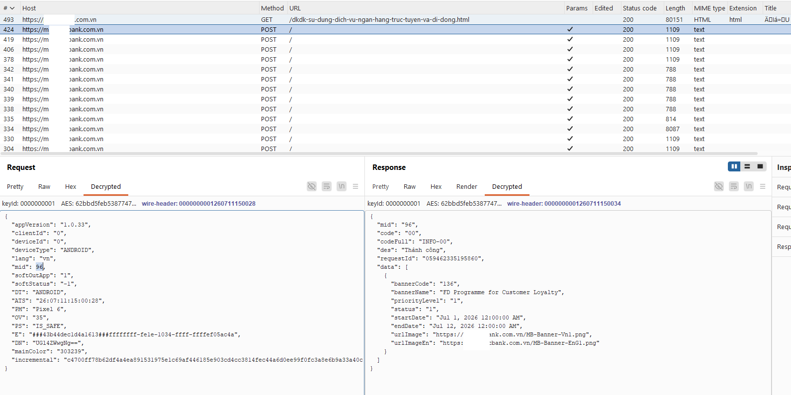
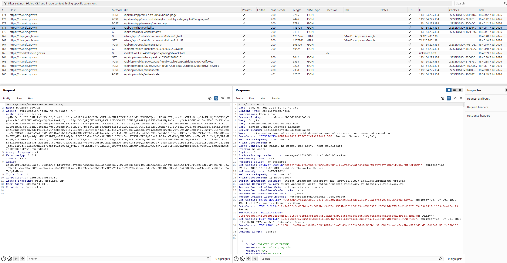

# The Night I Decided to Kill Frida

I'm writing this at almost 3 a.m., fourth coffee gone cold beside me. Partly to get it out of my head. Partly so future-me remembers exactly how miserable this got before it got good.

## Stuck

There are stretches in this job where you can feel yourself getting dumber by the day.

I was in the middle of an authorized assessment - proper scope, proper paperwork. The targets were the hardened, banking-style kind. App locked down to the teeth. My job was supposed to be simple: get inside, bypass the SSL pinning, watch the traffic, write it up. Something I've done a hundred times.

This time I couldn't get in.

Every way I knew how to hook died on contact. The app would sniff out my tooling the second it launched, then either kill itself or, worse, pretend to run normally while quietly blocking everything. I threw everything I had at it. I reread my old notes. I dusted off tricks that had saved me on past jobs. Nothing survived more than a couple of seconds.

I remember one night just staring at the screen, watching the app calmly close itself the instant I attached, honestly wondering if I'd lost it. And that's a bad feeling. Not the "this is a hard problem" kind. The "this door is locked, you don't have the key, and maybe you never will" kind.

Demoralized. The actual, literal word.

## The Idea

Then one night, right at the peak of the frustration, a question dropped into my head.

The problem wasn't that I was hooking wrong. The problem was that *the thing I was hooking with* got made before I could do anything at all. The app's defenses knew my tool's face. They didn't care what I wanted to do - they just had to see who showed up, and that was enough to throw me out.

So what if I changed the tool itself? What if I customized Frida, sanded off the tells that gave it away, so it could slip past without being recognized?

It sounded right. I went to bed lighter that night. Finally, a direction.

## Failure, Then a Decision

That direction ate days.

I tinkered, trimmed, masked one thing to hide another. A few times I thought I had it - surviving noticeably longer - and then it died anyway. Every seam I sealed, another one split open somewhere else. I was chasing my own shadow. The more I patched, the more it dawned on me that I was trying to rescue something that was marked in its own DNA. It gets recognized because of what it *is*.

And one night I sat up straight and finally admitted the thing I'd been dodging all week: this road goes nowhere.

So I made a slightly insane decision. No more customizing Frida. I'd write my own instrumentation tool. From scratch. Replace Frida completely in my workflow.

One clean sentence to write it down. At the time it felt like a cliff edge.

## The Build

This is where Claude Opus enters the story, and I want to tell this part straight - the good and the ugly both.

It took about a week just to *find the right idea*. Not to code. Just to think, read, cross things out, argue with myself about the approach. I used the AI as a wall to talk at until my own head cleared. I'd describe a direction, it would hand back a rough skeleton to cut into. And god, that saved me from the thing I hate most in the world: the blank file with the cursor blinking at me. Editing a mediocre draft beats staring at an empty screen with no idea how to type line one, every single time.

Then about another week to actually build the thing, pairing with Opus the whole way.

But here's where I have to warn you, because I paid in blood to learn it.

**At the low level, the AI is confidently wrong.**

The rarer the thing, the thinner the documentation, the deeper it lives in the guts of the system - the more the AI will just *invent* an answer that sounds completely reasonable. And the terrifying part: it sounds *identical* whether it's right or wrong. Same certainty. Same clean, articulate delivery. Its confidence has nothing to do with whether it's correct.

You know what's worse than no answer? A wrong answer that sounds right. Because a plausible-but-wrong answer costs you hours walking down a dead-end road, while an honest "I don't know" lets you turn around at the trailhead.

So I built a rule, and that rule became the spine of the whole coding week:

**Trust no line until you've run it on real hardware and watched it work with your own eyes.**

Every claim the AI made, I treated as a *hypothesis*, not a fact. Something to measure, not something to copy. It tells me this is definitely how it behaves - okay, let me load it onto a real device and see. Nine times out of ten, sure, it's right. That tenth time, if I'd trusted it blind, was enough to torch half a day.

And the further I got, the clearer one thing became: the AI doesn't create expertise out of nothing. It *amplifies* the expertise you already have. The only reason I could catch which lines were fabricated was that I had enough grounding to be suspicious. Someone without that foundation, handed this exact pairing, led along by that same even, confident voice - gets walked straight off a cliff while believing they're climbing.

## The Joy

I will never forget the moment it worked the first time.

I tested against the Frida labs first - the practice targets, the safe range. Typed the command. Held my breath.

It hooked in.

I came up out of my chair. Actually stood up, alone, in a dark room, near dawn, laughing like an idiot. After weeks of getting slapped in the face by these apps, after the whole failed Frida-customizing detour, after the nights I thought I was washed up - *my* tool, written with my own hands, had just quietly slipped in and done exactly what it was supposed to do.

That feeling was worth the whole miserable month put together.

But a lab is still just a lab. My gut knew the real fight was still ahead.

## It Works

So I took it out into the real world.

And it was good. Better than I let myself hope.

I can hook almost any app now with no real obstacles. Apps that used to boot me out the door in seconds - I sit comfortably inside them now. My current workflow is so clean it still surprises me:

Pull the APK. Decompile it with apktool. Hand the smali and the native library to the AI - for the native side I let it read straight into the binary through the IDA MCP. Then I state exactly what I want. And I ask it to write me a hook script for my tool.

Same old loop underneath: the AI proposes, I take it to real hardware and verify, keep what's true, throw out what isn't. But now the foundation is mine, so every turn of that loop is a lot faster.

## What I Learned, and What I Won't Tell You

If you read this far hoping I'd reveal *how* the tool works - sorry, friend.

I'll tell you *what* it does: it's a Frida alternative, it does instrumentation, and it doesn't get recognized by those defensive layers. But *how* it pulls that off - the mechanism, the architecture, the internals - I'm keeping shut. Not a line.

And that secrecy is, to me, part of the lesson. This tool's value lives precisely in the fact that it isn't known yet. Showing off how it runs would be handing the defenders a map to patch the exact seam I walk through - and turning my own tool into the next useless thing. Some things you build to use, not to exhibit.

To be clear, so nobody misreads me: everything I've described here happened inside authorized penetration testing - scoped, permitted, above board. This is a tool for finding holes and helping close them, not for wrecking things. It always comes down to whose hand the hammer is in.

As for the AI, here's the line I'd leave behind if this whole post got cut down to one:

**Let the AI propose. But never let it be the one who decides what's true.**

Judging true from false is your job. Yours, and the real device sitting on the desk - the one that tells you the truth whether you want to hear it or not. The AI is a brilliant collaborator, endlessly full of ideas, never tired. But it is not the arbiter of reality.

That role is yours. Don't ever hand it over.

Now let me go to sleep.

