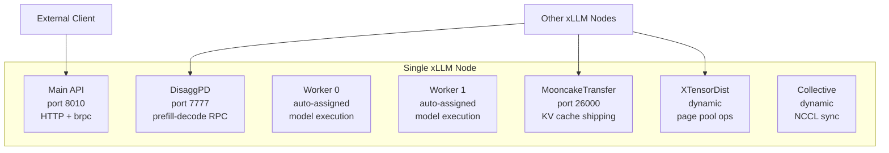
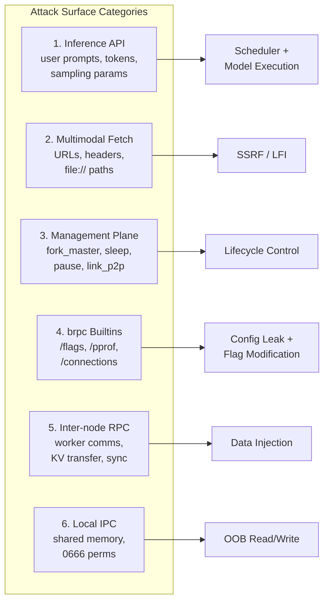
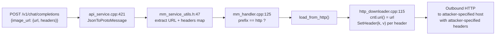
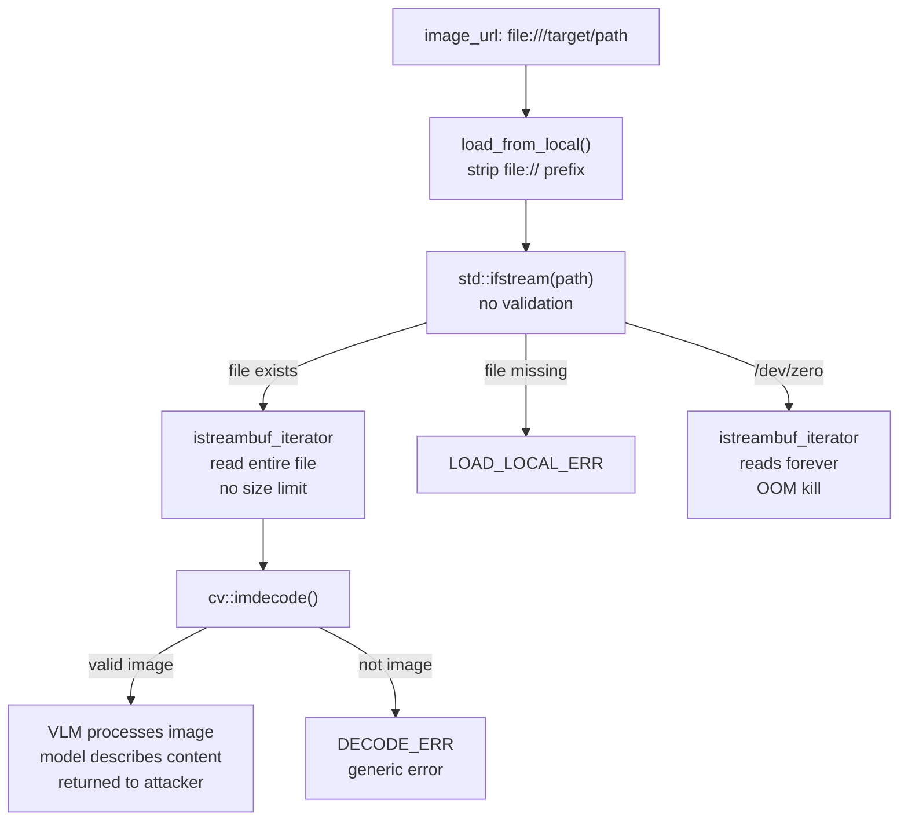
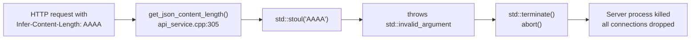

# No Keys Required: Inside the Attack Surface of xLLM

*A deep dive into the architecture and vulnerability classes hiding inside production LLM inference engines, through the lens of xLLM.*

**Security Research - July 2026**

LLM inference engines are a strange breed of software. They are built by ML engineers who think in tensors and throughput, deployed on GPU clusters worth millions, and then exposed to the internet through an HTTP API that trusts every byte it receives. The result is an attack surface that feels less like a web application and more like an industrial control system that someone accidentally port-forwarded.

xLLM is a high-performance, open-source LLM inference engine written in C++ on top of Apache brpc. It supports the full OpenAI and Anthropic API surface, handles multimodal inputs (vision, audio, video), and runs distributed multi-GPU inference with disaggregated prefill-decode scheduling. It powers deployment of Qwen, DeepSeek, LLaMA, and dozens of other model families. It was recently donated to the OpenAtom Foundation.

We spent three rounds auditing its codebase. What we found says less about xLLM specifically and more about a systemic pattern across the entire LLM serving ecosystem.

## The Architecture, Through an Attacker's Eyes

Before looking at individual bugs, it helps to understand *why* the attack surface of an inference engine looks the way it does. Three architectural properties shape everything that follows.

### Property 1: Multiple network listeners, zero authentication

xLLM is not a single-port web server. In a production distributed deployment, a single node can bind **seven or more brpc server ports**:



Every one of these ports speaks brpc's HTTP and protobuf-over-TCP protocols. We grepped the entire `xllm/` tree for `auth`, `token`, `api_key`, `bearer`, `Authorization`, `credential`, `password`, `allowlist`, `blocklist`. Zero results. We checked every `brpc::ServerOptions` instance for TLS or auth configuration. Nothing. We checked the protobuf message definitions for auth-related fields. None.

The sole gating mechanism we found was `enable_online_profile` (a feature flag for the CPU profiler, default off, not an auth check) and a `RateLimiter` that caps concurrent requests at 200 without distinguishing users.

This means the management endpoints - `fork_master` (load a model from any filesystem path), `sleep`/`wakeup` (unload/reload models), `pause` (abort all in-flight requests), `link_p2p` (establish connections to arbitrary addresses) are accessible to anyone who can reach the port.

### Property 2: The multimodal surface is a proxy

When serving vision-language models, xLLM's API accepts URLs in `image_url`, `video_url`, and `audio_url` fields. The server fetches these URLs server-side to download the media content before passing it to the model. This turns the inference engine into an HTTP proxy that makes outbound requests on behalf of the client a classic SSRF surface.

What makes this surface particularly interesting in LLM engines is the **multimodal decode pipeline**. The fetched bytes go through format-specific decoders (OpenCV for images, FFmpeg for video/audio). The decoder output becomes a tensor that feeds the model. The model's text output is returned to the client. This creates an indirect data channel: if the attacker can control what the model sees, they can influence what the model says.

### Property 3: brpc's builtin services are opt-out

Apache brpc is a high-performance RPC framework used widely in Chinese tech infrastructure (Baidu, JD, ByteDance). One of its features is a built-in debug console: `/flags` (view/modify all gflags), `/vars` (internal metrics), `/connections` (active connections), `/pprof/*` (CPU/heap profiling), `/status`. These are enabled by default on every server port unless the developer explicitly sets `has_builtin_services = false`.

This is the brpc equivalent of leaving Django's `DEBUG=True` in production except it exposes runtime flags that can be *modified*, not just read.

## Mapping the Attack Surface

With the architecture understood, here is how we decomposed the surface. Each category represents a different trust boundary the engine fails to enforce.



Categories 1 and 5-6 turned out to be well-defended or require non-default configurations. Categories 2-4 produced four confirmed findings. The interesting story is in both: what broke and what held.

## The Multimodal Proxy: Blind SSRF with Header Forwarding

The first thing we traced was the multimodal URL fetch path. In `mm_handler.cpp`, the `ImageHandler::load()` method dispatches on URL prefix:

```cpp
// xllm/core/framework/multimodal/mm_handler.cpp:112-138
MMErrCode ImageHandler::load(const MMContent& content,
                             MMInputItem& input,
                             MMPayload& payload) {
  const auto& url = content.image_url.url;

  if (url.compare(0, dataurl_prefix_.size(), dataurl_prefix_) == 0) {
    // "data:image/..." - base64 encoded, handled locally
    return this->load_from_dataurl(url, input.raw_data, payload);

  } else if (url.compare(0, httpurl_prefix_.size(), httpurl_prefix_) == 0) {
    // "http://..." or "https://..." - server fetches the URL
    return this->load_from_http(url, input.raw_data,
                                content.image_url.headers);  // <---

  } else {
    // everything else: treat as local file path
    if (this->load_from_local(url, input.raw_data) == MMErrCode::SUCCESS) {
      return MMErrCode::SUCCESS;
    }
    return MMErrCode::INVALID_URL_ERR;
  }
}
```

The `httpurl_prefix_` is the 4-character string `"http"`. Any URL starting with `http` both `http://` and `https://` enters the server-side fetch path. The URL flows through `load_from_http()` into `BRpcDownloader::download()`:

```cpp
// xllm/core/util/http_downloader.cpp:109-144
bool BRpcDownloader::download(
    const std::string& host, const std::string& url,
    std::string& data,
    const std::unordered_map<std::string, std::string>& headers) {

  brpc::Controller cntl;
  cntl.http_request().uri() = url;          // attacker URL, verbatim

  for (const auto& [k, v] : parse_global_headers()) {
    cntl.http_request().SetHeader(k, v);    // global defaults
  }
  for (const auto& [k, v] : headers) {
    cntl.http_request().SetHeader(k, v);    // per-request: attacker-controlled
  }

  cntl.set_timeout_ms(2000);
  auto channel = get_channel(host);
  channel->CallMethod(nullptr, &cntl, nullptr, nullptr, nullptr);
  // ...
}
```

The `parse_url()` function (line 60) that runs before this does one thing: it splits the URL at `://` and the next `/` to extract the host. No validation of the host. No check against private IP ranges. No scheme restriction. No redirect following limit. The URL goes straight to `brpc::Channel::Init(host)` and then `CallMethod`.

The critical detail is the `headers` parameter. It comes from the protobuf definition at `multimodal.proto:28`:

```protobuf
// xllm/proto/multimodal.proto
message ImageURL {
  string url = 1;
  map<string, string> headers = 2;   // attacker-controlled key-value pairs
}
```

These headers are extracted at `mm_service_utils.h:50-51` and forwarded verbatim to the outbound request. An attacker can include `Authorization`, `Cookie`, or any other header, turning the blind SSRF into an authenticated proxy for internal services.



The SSRF is **blind** for non-image responses. Cloud metadata endpoints return JSON, which fails OpenCV's `imdecode()`, and the client sees only "Failed to decode multimodal input." But "blind" here still means the attacker can distinguish four states via timing and error differentiation: connection refused (~1ms), connection timeout (2000ms), HTTP 200 with non-image data (`DECODE_ERR`), and HTTP 200 with valid image (the VLM processes it). This enables reliable port scanning and service fingerprinting of the internal network.

This is the exact same bug class as [CVE-2025-6242 in vLLM](https://nvd.nist.gov/vuln/detail/CVE-2025-6242). The pattern is systemic: every LLM engine that fetches multimodal URLs server-side without validation inherits this surface.

## The Debug Console Nobody Turned Off

Every `brpc::ServerOptions` in xLLM is default-constructed. The field `has_builtin_services` is never touched:

```cpp
// xllm/server/xllm_server.cpp:141-150
brpc::ServerOptions options;
options.idle_timeout_sec =
    ::xllm::ServiceConfig::get_instance().rpc_idle_timeout_s();
options.num_threads = ::xllm::ServiceConfig::get_instance().num_threads();
options.health_reporter = &HealthReporter::instance();
// has_builtin_services is never set - brpc defaults it to true
if (server_->Start(port, &options) != 0) { ... }
```

The same pattern at line 269 (the generic `create_server()` used for DisaggPD, Collective, Worker, and XTensorDist servers) and at `mooncake_transfer_engine.cpp:152`. We grep'd for `has_builtin_services` and `internal_port` across the entire codebase: zero hits.

The consequence is that every brpc port exposes the full builtin suite. `GET /flags` dumps all 189 xLLM gflags plus brpc's own, including model paths, network addresses, etcd endpoints, and config file locations. `GET /pprof/cmdline` reads `/proc/self/cmdline` and returns the complete startup command with all arguments. `GET /connections` reveals the internal cluster topology.

And because `FLAGS_immutable_flags` is also never set, flags can be *modified* at runtime via `GET /flags/<name>?setvalue=<val>`.

### The singleton firewall

We investigated whether flag modification could escalate to RCE. The answer is no, and the reason is architecturally interesting. xLLM copies all flag values into singleton config objects at startup:

```cpp
// Config initialization pattern (simplified)
// At startup:
ModelConfig::get_instance().initialize();  // reads FLAGS_model, FLAGS_backend, etc.

// At runtime, all application code reads from the singleton:
auto path = ModelConfig::get_instance().model_path();  // not FLAGS_model
```

After initialization, the singletons are immutable. Modifying `FLAGS_model`, `FLAGS_python_model_path`, `FLAGS_enable_xtensor`, or `FLAGS_enable_shm` via `/flags` has zero effect on running behavior. The flags that *are* read live are brpc's own: setting `FLAGS_max_body_size` to 0 makes brpc reject all subsequent requests ("message too large"), a persistent DoS that requires no restart. Setting `FLAGS_minloglevel` to 3 silences all logs.

> **Accidental defense-in-depth.** The singleton config pattern was almost certainly designed for performance (avoid re-reading flags on every request), not security. But it creates an effective firewall between the `/flags` endpoint and the application's critical state. Many brpc-based services read `FLAGS_` directly, where this same exposure would be catastrophic.

## The Other Branch: Arbitrary File Read

Back to the three-way URL dispatch in `ImageHandler::load()`. The else-branch at line 130 is the interesting one: everything that does not start with `"data:image"` or `"http"` falls through to `load_from_local()`. Since `"file"[0] != "http"[0]`, any `file://` URL and any bare absolute path reaches this code:

```cpp
// xllm/core/framework/multimodal/mm_handler.cpp:82-98
MMErrCode MMHandlerBase::load_from_local(const std::string& url,
                                         std::string& data) {
  std::string path = url;
  const std::string prefix = "file://";
  if (path.compare(0, prefix.size(), prefix) == 0) {
    path = path.substr(prefix.size());     // strip "file://", that's it
  }

  std::ifstream in(path, std::ios::binary);
  if (!in) {
    LOG(ERROR) << "failed to open local file: " << path;
    return MMErrCode::LOAD_LOCAL_ERR;
  }

  data.assign(std::istreambuf_iterator<char>(in),
              std::istreambuf_iterator<char>());
  return MMErrCode::SUCCESS;
}
```

No allowlist. No chroot. No symlink resolution. No `../` filtering. No file size limit. The `istreambuf_iterator` reads until EOF. The bytes go into `data`, then to `cv::imdecode()`.

We spent a full investigation round trying to upgrade this to full content exfiltration. The results were definitive: OpenCV's decode pipeline (`imdecode` + `convert_decoded_image_to_rgb`) strips all metadata. EXIF, PNG tEXt chunks, nothing survives. Non-image files produce an empty `cv::Mat` and a generic decode error. The raw bytes are in server memory but never returned to the client.

What *does* work:

- **File existence oracle.** Two distinct error messages: `DECODE_ERR` ("Failed to decode multimodal input") when the file exists but is not a valid image, `INVALID_URL_ERR` ("url must be data URL / http(s) URL / local file URL") when the file does not exist. This allows enumerating the filesystem, including `/proc/self/environ`, `/proc/self/maps`, and open file descriptors at `/proc/self/fd/<N>`.
- **Image exfiltration via VLM.** If the file at the target path happens to be a valid PNG, JPEG, or BMP, it is decoded, passed to the vision-language model, and the model's description is returned to the client. Screenshots, charts, photos anything the server process can read and OpenCV can decode.
- **OOM crash.** Pointing the URL at `/dev/zero` causes the `istreambuf_iterator` to read forever, allocating memory until the kernel OOM-kills the process.



Note that only `ImageHandler` has this local-file fallback. `VideoHandler::load()` and `AudioHandler::load()` return `INVALID_URL_ERR` for non-data/non-http URLs.

## One Header to Kill Them All

This one is the smallest finding and the most reliable. xLLM defines a custom HTTP header, `Infer-Content-Length`, used to split a request body into a JSON region and a binary multimodal payload region. The header value is parsed by `get_json_content_length()`:

```cpp
// xllm/api_service/api_service.cpp:301-315
size_t get_json_content_length(const brpc::Controller* ctrl) {
  const auto infer_content_len =
      ctrl->http_request().GetHeader(kInferContentLength);
  if (infer_content_len != nullptr) {
    return std::stoul(*infer_content_len);   // throws on non-numeric input
  }

  const auto content_len = ctrl->http_request().GetHeader(kContentLength);
  if (content_len != nullptr) {
    return std::stoul(*content_len);         // same pattern
  }

  LOG(ERROR) << "Content-Length header is missing.";
  return (size_t)-1L;
}
```

`std::stoul` throws `std::invalid_argument` for non-numeric input and `std::out_of_range` for overflow. There is no `try-catch` here. There is no `try-catch` in any caller. There is no `try-catch` in brpc's service dispatch - service methods run in bthreads, and an uncaught exception in a bthread invokes `std::terminate()`.

The same pattern repeats at `call.cpp:50-51` in `Call::init_request_payload()`, which runs for every endpoint that processes a request body.

A single HTTP request with `Infer-Content-Length: AAAA` terminates the entire server process. Every in-flight request from every user dies with it. The header is non-standard, so no reverse proxy validates or strips it.



## What Held Up

A security audit that only reports what broke is incomplete. The surfaces we investigated and found well-defended tell us as much about the system's security posture as the vulnerabilities do.

**Safetensors model loading.** Model weights are parsed by a **Rust crate** (safetensors v0.6.0) compiled as a static library with C FFI bindings. The Rust parser validates JSON header sizes, tensor offset/size boundaries, and dtype values before the C++ consumer at `state_dict.cpp` ever sees the data. Memory-mapped files use `MAP_PRIVATE | PROT_READ`. There is no `pickle.loads`, no `torch.load`, no GGUF parser. This is the most secure model weight loading we have seen in any inference engine.

**Jinja chat templates.** The minja C++ Jinja library receives user messages as structured `nlohmann::ordered_json` data at `jinja_chat_template.cpp:76-113`. The template itself is loaded from the model's `tokenizer_config.json` at initialization and is never user-controlled. Jinja's rendering pipeline treats `{{ }}` and `` in data values as literal text, not template directives. No SSTI.

**Binary multimodal payload parsing.** The `binary,<length>` data URL format uses `butil::StringToSizeT()` for length parsing (rejects non-numeric, handles overflow) and `MMPayload::get()` bounds-checks against available data. No integer overflow, no OOB read.

**HTTP request smuggling.** xLLM's brpc fork is based on version 1.12.1, past the CVE-2024-23452 fix in 1.8.0. The custom `Infer-Content-Length` header only affects how xLLM reads from brpc's already-consumed body buffer (`request_attachment()`), not the TCP stream. No desync possible.

**Sampling parameter validation.** Temperature is clamped to `[0.0, 2.0]` at `request_params.cpp:597`. Zero temperature is gracefully replaced with 1.0 at `logits_utils.cpp:64`. Top-k is clamped to vocab size. Token lengths are validated by the scheduler against the model's max context length. NaN values via raw protobuf (not HTTP/JSON) can bypass range checks, but the impact is limited to single-request output corruption, not a crash.

**Shared memory IPC.** The `ForwardSharedMemoryManager` creates segments with mode 0666 and predictable names, and its read functions (`read_string`, `read_vector`, `read_tensor`) lack bounds checking. This is technically exploitable by a local attacker. But `enable_shm` defaults to `false`, so the segments are never created in default deployment. The vulnerability is real but conditional on a non-default performance optimization flag.

## The Systemic Pattern

None of the bugs we found required a novel exploitation technique. SSRF, path traversal, information disclosure, uncaught exception these are textbook classes that web application security has understood for two decades. What is interesting is not the individual bugs but the **architectural assumptions** that produced all four simultaneously.

LLM inference engines occupy a strange middle ground in the software stack. They are built like internal infrastructure no auth, management APIs wide open, debug surfaces enabled, inter-node communication in plaintext but deployed at the trust boundary of a public-facing API. The implicit threat model is "the network is trusted." When that assumption fails, every surface fails at once.

This is not unique to xLLM. The same pattern produced:

- **CVE-2025-6242** - vLLM SSRF via `MediaConnector.load_from_url()`, the exact same bug class.
- **CVE-2024-50050** - Meta Llama Stack pickle deserialization over an unauthenticated ZMQ socket.
- **CVE-2025-30165** - vLLM pickle deserialization over ZMQ, same pattern.
- **CVE-2025-23254** - NVIDIA TensorRT-LLM, same pattern.

The LLM serving ecosystem is replaying the early web framework era: ship for throughput, authenticate later. The difference is that the blast radius is larger an inference engine compromise exposes model weights, user prompts, internal network topology, and cloud credentials and the "later" keeps not arriving.

> The assumption that "the network is trusted" is load-bearing in every design decision. When that assumption fails, everything fails at once. The fix is not to patch individual bugs. The fix is to stop building inference engines like they will only ever run inside a VPN.

One bright spot: xLLM's Rust-based safetensors parser and its accidental singleton config firewall show that defense-in-depth can emerge even without deliberate security engineering. The lesson is to make it deliberate.

## References

- xLLM source: `github.com/xLLM-AI/xllm` (Apache 2.0, commit `37413cfe`)
- vLLM SSRF: [CVE-2025-6242](https://nvd.nist.gov/vuln/detail/CVE-2025-6242)
- brpc builtin services RCE: [CVE-2025-60021](https://nvd.nist.gov/vuln/detail/CVE-2025-60021)
- brpc HTTP smuggling: [CVE-2024-23452](https://nvd.nist.gov/vuln/detail/CVE-2024-23452)
- Meta Llama pickle deser: [CVE-2024-50050](https://nvd.nist.gov/vuln/detail/CVE-2024-50050)
- Research conducted with Claude Code. Agent fleet parallelized surface enumeration and adversarial cross-verification; human judgment drove threat modeling and severity assessment.
